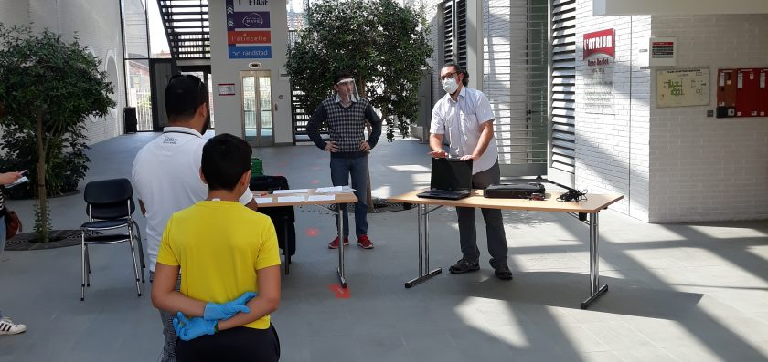

Title: Première distribution d'ordinateurs
Date: 2020-04-10 14:30
Modified: 2020-04-10 14:30
Tags: association, logiciel, libre
Slug: 1er-distribution-ordinateurs
Lang: fr
Authors: libraisol
Summary: Première distribution d'ordinateurs

La crise sanitaire actuelle ayant révélé un besoin d'équipement informatique,
notamment pour la continuité pédagogique, nous avons décidé d'agir malgré
nos réticences à pallier l'incurie du ministère de l'Éducation qui prétendait
en début de crise que tout avait été prévu.

De nombreuses familles se sont retrouvées dans l'incapacité d'effectuer les
travaux demandés par les équipes pédagogiques, qui dans l'euphorie des discours
du ministre Blanquer, ont beaucoup misé sur l'équipement informatique des familles.

Nous nous sommes donc lancés dans la distribution d'ordinateurs, reconvertis
au système d'exploitation **libre** GNU/Linux.

La pression commerciale des principaux éditeurs de logiciels privateurs provoque,
par les mises à jour de leurs logiciels, l’obsolescence des ordinateurs.
Le logiciel libre, en plus d’être une solution plus respectueuse des données
personnelles des utilisateurs, permet de prolonger la vie des ordinateurs.
L’utilisation de ces logiciels étant libre, des informaticiens peuvent préparer
et installer ces logiciels sans avoir à payer de redevances à un quelconque éditeur,
ce qui permet à une association comme LIBRaiSOL de proposer des adhésions à un prix modique.

Les utilisateurs d’ordinateurs ont une liberté toute relative par rapport à la
domination des éditeurs de logiciels privateurs, qui imposent leurs logiciels
à l'achat, comme le système d'exploitation Windows qui contrôle de plus les mises à jour.
Leurs configurations par défaut étant prévues pour aspirer un maximum de
données personnelles, l’enjeu en devient démocratique.
